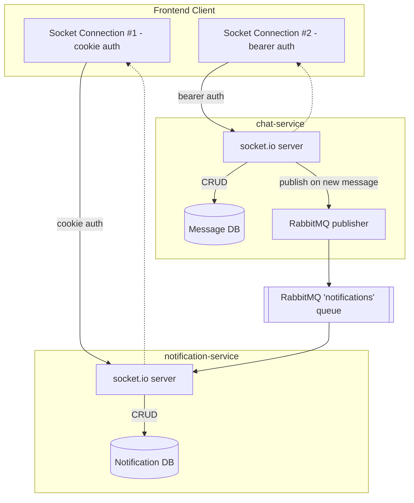
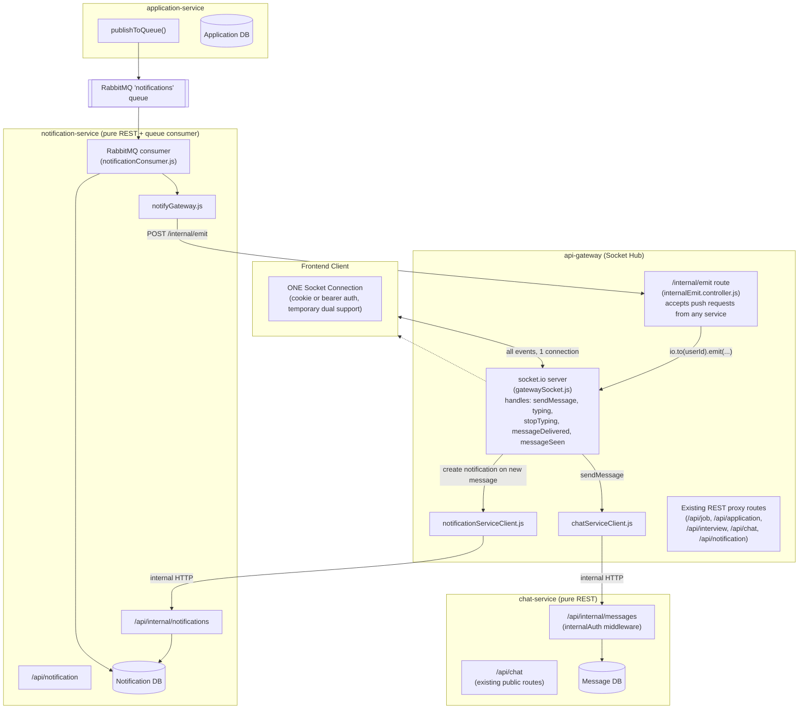
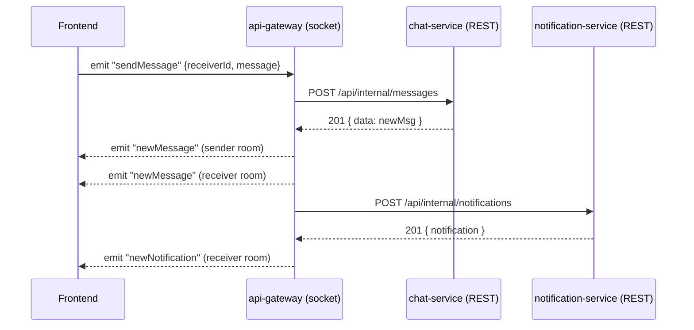
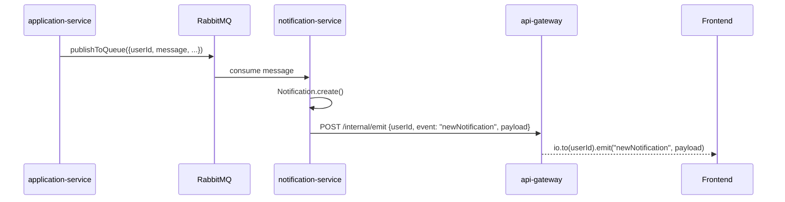

# Socket Unification — Final Architecture (API Gateway as Socket Hub)

**Branch:** `feature/unify-chat-notification-socket`
**Services affected:** `api-gateway`, `chat-service`, `notification-service`, `application-service`
**Status:** Implementation complete, pending `.env` consistency check + end-to-end test

---

## 1. Problem Statement

Every logged-in user previously opened **multiple independent WebSocket connections** — one to `chat-service`, one to `notification-service`. Each service ran its own `socket.io` server, maintained its own `userId → socket` room mapping, and used a different auth strategy (one cookie-based, one bearer-token-based).

**Goal:** A single socket connection per user, handling all real-time events (chat + notifications), regardless of which backend service actually owns the underlying data.

---

## 2. Before: Multiple Independent Socket Servers



**Problems:** 2 connections per user, 2 auth flows, duplicated handshake/heartbeat overhead, no single place to reason about "is this user online."

---

## 3. Why API Gateway (and not one of the services) as the Hub

The repo already has an `api-gateway` service that sits in front of every microservice as a **REST proxy** (`user-service`, `job-service`, `application-service`, `interview-service`, `notification-service`, `chat-service` all get proxied through it, with JWT verification happening once at the gateway).

Since it's already the single client-facing entry point for REST, it's the natural place to also be the single client-facing entry point for **real-time** traffic. This keeps every backend service (`chat-service`, `notification-service`, `application-service`, etc.) as a **pure data/business-logic layer** — no service other than the gateway needs to know sockets exist.

---

## 4. After: API Gateway as the Single Socket Hub



---

## 5. What Changed — Per Service

### `api-gateway` (new responsibilities added)

| File                                                           | Status       | Purpose                                                                                                                                                   |
| -------------------------------------------------------------- | ------------ | --------------------------------------------------------------------------------------------------------------------------------------------------------- |
| `src/sockets/socketInstance.js`                              | 🆕 New       | Stores/retrieves the single`io` instance globally                                                                                                       |
| `src/sockets/gatewaySocket.js`                               | 🆕 New       | The socket hub: dual auth (cookie/bearer), room join, all chat event handlers                                                                             |
| `src/controllers/internalEmit.controller.js`                 | 🆕 New       | Accepts push requests from any backend service and emits to the right user                                                                                |
| `src/routes/internalEmit.route.js`                           | 🆕 New       | `POST /internal/emit`, protected by shared-secret                                                                                                       |
| `src/middlewares/internalAuth.middleware.js`                 | 🆕 New       | Verifies`x-internal-secret` header on internal-only routes                                                                                              |
| `src/utils/chatServiceClient.js`                             | 🆕 New       | Internal HTTP client → chat-service                                                                                                                      |
| `src/utils/notificationServiceClient.js`                     | 🆕 New       | Internal HTTP client → notification-service                                                                                                              |
| `app.js`                                                     | ✏️ Updated | `express.json()` moved above all routes; `/internal/emit` mounted before proxy routes                                                                 |
| `index.js`                                                   | ✏️ Updated | `http.createServer(app)` + `socket.io` `Server` attached to the *same* HTTP server; socket handler registered only after `connectDb()` resolves |
| Existing REST proxy routes (`/api/job`, `/api/chat`, etc.) | ✅ Unchanged | Still works exactly as before                                                                                                                             |

### `chat-service` (stripped down to pure REST)

| File                                          | Status       | Purpose                                                                                           |
| --------------------------------------------- | ------------ | ------------------------------------------------------------------------------------------------- |
| `src/sockets/chat.js`                       | ❌ Deleted   | No socket server here anymore                                                                     |
| `src/utils/rabbitmq.js`                     | ❌ Deleted   | No longer publishes to any queue                                                                  |
| `src/middleware/internalAuth.middleware.js` | 🆕 New       | Shared-secret check for gateway-originated calls                                                  |
| `src/routes/internal.route.js`              | 🆕 New       | `POST /`, `PUT /:id/delivered`, `PUT /seen`                                                 |
| `src/controllers/message.controller.js`     | ✏️ Updated | Added`createMessage`, `markDelivered`, `markSeenBulk`                                       |
| `app.js`                                    | ✏️ Updated | Mounts`internal.route.js` at `/api/internal/messages`                                         |
| `index.js`                                  | ✏️ Updated | Plain`app.listen()` — no `http.createServer`, no `Server` (socket.io), no RabbitMQ connect |
| `package.json`                              | ✏️ Updated | `socket.io`, `amqplib` uninstalled                                                            |

### `notification-service` (pure REST + queue consumer, no socket)

| File                                           | Status             | Purpose                                                                                                                                       |
| ---------------------------------------------- | ------------------ | --------------------------------------------------------------------------------------------------------------------------------------------- |
| `src/sockets/`                               | ❌ Deleted (empty) | No socket server here anymore                                                                                                                 |
| `src/middlewares/internalAuth.middleware.js` | 🆕 New             | Shared-secret check                                                                                                                           |
| `src/routes/internal.route.js`               | 🆕 New             | `POST /` → `createNotification`                                                                                                          |
| `src/controllers/notification.controller.js` | ✏️ Updated       | `createNotification` now just persists to DB — no `getIO()`/socket emit (that logic was dead code since sockets don't live here anymore) |
| `src/utils/notifyGateway.js`                 | 🆕 New             | HTTP client → api-gateway's`/internal/emit`                                                                                                |
| `src/queues/notificationConsumer.js`         | ✏️ Updated       | On message from RabbitMQ: save to DB, then call`notifyGateway()` instead of `io.emit()`                                                   |
| `app.js`                                     | ✏️ Updated       | Mounts`internal.route.js` at `/api/internal/notifications`                                                                                |
| `index.js`                                   | ✏️ Updated       | No`setIO`/socket handler registration                                                                                                       |
| `package.json`                               | ✏️ Updated       | `socket.io` uninstalled                                                                                                                     |

### `application-service` (unchanged flow, existing RabbitMQ retained)

| File                           | Status             | Purpose                                                                         |
| ------------------------------ | ------------------ | ------------------------------------------------------------------------------- |
| `src/utils/rabbitmq.js`      | ✅ Kept            | `applyJob` still publishes to the `notifications` queue on new applications |
| `src/utils/notifyGateway.js` | ✅ Already present | Available if a direct/synchronous push is ever needed alongside the queue       |

---

## 6. Event Flow Example 1: Sending a Chat Message



## 7. Event Flow Example 2: Async Notification (Job Application via RabbitMQ)



---

## 8. Key Design Decisions

| Decision                                                                                      | Reasoning                                                                                                                                                                                                       |
| --------------------------------------------------------------------------------------------- | --------------------------------------------------------------------------------------------------------------------------------------------------------------------------------------------------------------- |
| **API Gateway as hub, not a new dedicated service**                                     | Gateway already exists as the single REST entry point with JWT auth in place — reusing it avoids standing up and deploying a new service                                                                       |
| **Internal HTTP calls, not Redis Pub/Sub, for gateway push**                            | Simpler to implement/reason about at current single-instance scale. Revisit with Redis Pub/Sub if the gateway is ever horizontally scaled, since HTTP calls assume one gateway instance holds the user's socket |
| **RabbitMQ kept for `application-service` → `notification-service`**               | Async, reliable delivery — if notification-service is briefly down, the queue holds the message. A direct HTTP call would simply fail                                                                          |
| **RabbitMQ removed from `chat-service`**                                              | `sendMessage` is a synchronous, user-facing action needing immediate feedback — a queue round-trip adds latency with no benefit here. A direct internal HTTP call from the gateway is sufficient             |
| **Dual auth (cookie + bearer) temporarily on the gateway socket**                       | Avoids requiring an immediate frontend change. To be removed once frontend fully migrates to cookie-based socket auth                                                                                           |
| **`typing` / `stopTyping` handled entirely inside the gateway, no downstream call** | These are ephemeral, non-persisted events — no reason to round-trip to chat-service                                                                                                                            |

---

## 9. Environment Variables (must match exactly across services)

**`api-gateway/.env`**

```
FRONTEND_URL=http://localhost:3000
CHAT_SERVICE_URL=http://localhost:5005
NOTIFICATION_SERVICE_URL=http://localhost:5006
INTERNAL_SERVICE_SECRET=<shared-secret>
```

**`chat-service/.env`**

```
INTERNAL_SERVICE_SECRET=<shared-secret>   # must match api-gateway exactly
```

**`notification-service/.env`**

```
API_GATEWAY_URL=http://localhost:5000
INTERNAL_SERVICE_SECRET=<shared-secret>   # must match api-gateway exactly
```

⚠️ **Known open item:** naming was inconsistent during development (`INTERNAL_SECRET` vs `INTERNAL_SERVICE_SECRET` appeared in different files). All services must standardize on **`INTERNAL_SERVICE_SECRET`** before merge.

---

## 10. Result Summary

| Before                                                                            | After                                                                       |
| --------------------------------------------------------------------------------- | --------------------------------------------------------------------------- |
| 2+ socket connections per user                                                    | 1 socket connection per user, via api-gateway                               |
| 2 separate, inconsistent auth flows                                               | 1 auth flow at the gateway (temporarily dual, converging to cookie-only)    |
| `chat-service` and `notification-service` each ran their own socket.io server | Neither service touches sockets; both are pure REST/queue-consumer services |
| Real-time push logic scattered across services                                    | Centralized in`api-gateway` (`gatewaySocket.js` + `/internal/emit`)   |
| No single place to reason about "is this user online"                             | api-gateway's socket rooms are the single source of truth                   |

---

## 11. Outstanding / To-Do Before Merge

- [ ] Standardize `INTERNAL_SERVICE_SECRET` naming across all `.env` files and code
- [ ] Confirm `notification.controller.js`'s dead `getIO()` block is removed
- [ ] End-to-end test: single socket connects to api-gateway, `sendMessage` → `newMessage` + `newNotification` both arrive
- [ ] End-to-end test: job application → RabbitMQ → notification-service → gateway → real-time push to employer
- [ ] Remove temporary bearer-token fallback in `gatewaySocket.js` once frontend is cookie-only
- [ ] Open PR with this document linked for reviewer context
