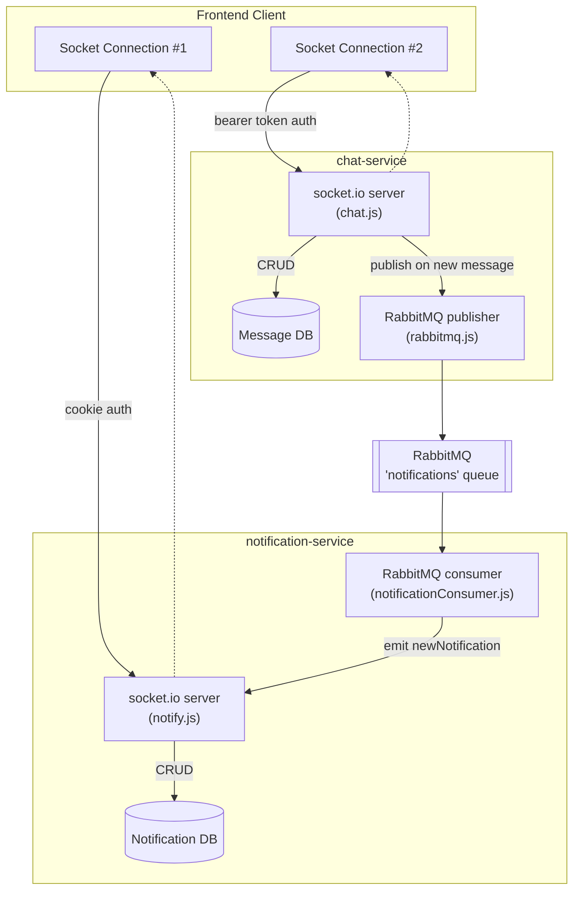
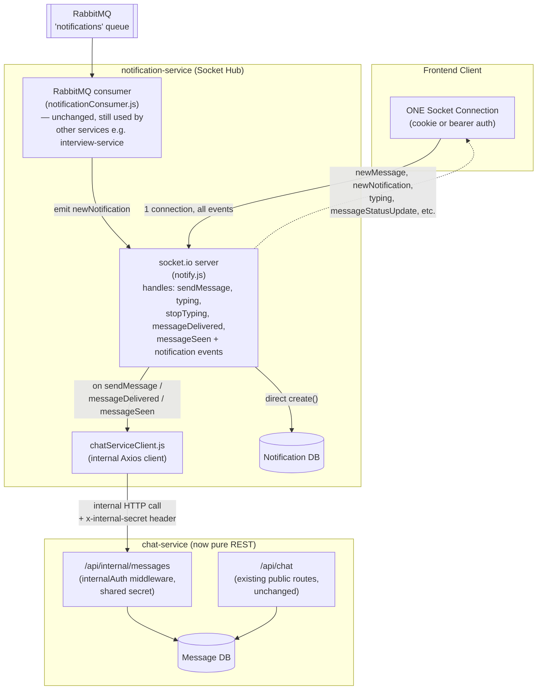
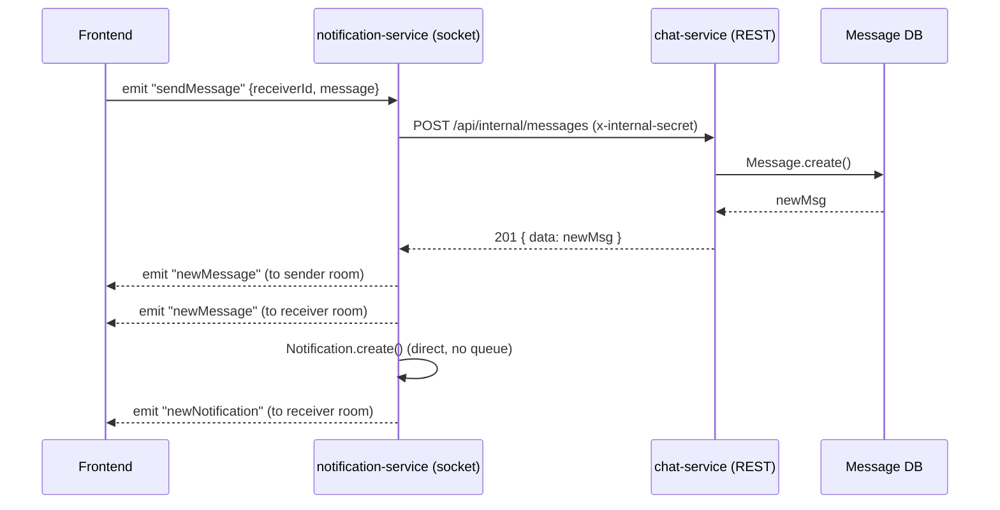

# Socket Unification: Chat + Notification Migration

**Branch:** `feature/unify-chat-notification-socket`
**Services affected:** `chat-service`, `notification-service`
**Status:** Implementation complete, pending end-to-end test + review

---

## 1. Problem Statement

Previously, every logged-in user opened **two separate WebSocket connections**:

- One to `notification-service` (for notifications)
- One to `chat-service` (for chat messaging)

This meant duplicated handshakes, duplicated JWT verification, duplicated heartbeat/reconnect logic, and two independent `userId → socket` mappings for the same user. As the platform grows (presence, live updates, etc.), this pattern doesn't scale cleanly.

**Goal:** A single socket connection per user that handles both notification and chat events.

---

## 2. Before: Two Independent Socket Servers



**Issues with this setup:**

| Issue                                                                        | Impact                                                                 |
| ---------------------------------------------------------------------------- | ---------------------------------------------------------------------- |
| 2 socket connections per user                                                | 2x handshake, 2x auth, 2x reconnect overhead                           |
| 2 separate`userId → socket` room mappings                                 | Harder to reason about presence/online status                          |
| Inconsistent auth strategy (cookie vs bearer)                                | Two code paths to maintain                                             |
| `chat.js` had a stray Express `res` reference inside a socket middleware | Would throw at runtime (`res` doesn't exist in socket.io middleware) |
| `socket.io('stopTyping', ...)` typo                                        | `stopTyping` handler never actually registered                       |

---

## 3. After: Single Socket Server (notification-service as the Hub)



**Key architectural decision:** `chat-service` no longer owns any socket connection or RabbitMQ publisher. It's now a pure REST/internal-API service. `notification-service` is the single real-time hub for the whole platform.

---

## 4. What Changed — File by File

### `chat-service`

| File                                          | Change                                                                                                                                     |
| --------------------------------------------- | ------------------------------------------------------------------------------------------------------------------------------------------ |
| `src/sockets/chat.js`                       | ❌ Deleted — socket logic no longer lives here                                                                                            |
| `src/utils/rabbitmq.js`                     | ❌ Deleted — no longer publishes to RabbitMQ                                                                                              |
| `src/middleware/internalAuth.middleware.js` | ✅ New — validates`x-internal-secret` header for service-to-service calls                                                               |
| `src/routes/internal.route.js`              | ✅ New — internal-only routes:`POST /`, `PUT /:id/delivered`, `PUT /seen`                                                           |
| `src/controllers/message.controller.js`     | ✅ Added`createMessage`, `markDelivered`, `markSeenBulk` (existing `getMessages`, `updateMessage`, `getUnreadCount` untouched) |
| `app.js`                                    | ✅ Mounted`internalRoute` at `/api/internal/messages`                                                                                  |
| `index.js`                                  | ✅ Removed`http`, `socket.io` `Server`, `chatSocketHandler`, `connectRabbitMQ` — now plain `app.listen()`                     |
| `package.json`                              | ✅`socket.io`, `amqplib` uninstalled                                                                                                   |

### `notification-service`

| File                                   | Change                                                                                                                                                                                                                            |
| -------------------------------------- | --------------------------------------------------------------------------------------------------------------------------------------------------------------------------------------------------------------------------------- |
| `src/sockets/notify.js`              | ✅ Extended — now handles chat events (`sendMessage`, `typing`, `stopTyping`, `messageDelivered`, `messageSeen`) in addition to existing notification connection logic; dual auth (cookie + temporary bearer fallback) |
| `src/utils/chatServiceClient.js`     | ✅ New — internal Axios client that calls`chat-service`'s internal API                                                                                                                                                         |
| `src/sockets/socketInstance.js`      | No change                                                                                                                                                                                                                         |
| `src/queues/notificationConsumer.js` | No change — still consumes the`notifications` RabbitMQ queue for notifications published by other services                                                                                                                     |
| `app.js` / `index.js`              | No change                                                                                                                                                                                                                         |

### Environment Variables

**`chat-service/.env`**

```
INTERNAL_SERVICE_SECRET=<shared-secret>
```

**`notification-service/.env`**

```
CHAT_SERVICE_URL=http://localhost:5005
INTERNAL_SERVICE_SECRET=<shared-secret>   # must match chat-service exactly
```

---

## 5. Event Flow Example: Sending a Chat Message



---

## 6. Bugs Fixed Along the Way

1. **`res` used inside socket.io middleware** in old `chat.js` — socket.io middleware doesn't have an Express `res` object; replaced with `next(new Error(...))` pattern.
2. **`socket.io('stopTyping', ...)` typo** — was never registered as an event listener; fixed to `socket.on(...)`.
3. **Room name / ObjectId mismatch risk** — `socket.join(userId)` and `io.to(userId)` now consistently use `.toString()` to avoid silent room-mismatch when Mongoose returns an `ObjectId` instead of a string.

---

## 7. Known Temporary Decisions

- **Dual auth (cookie + bearer) in `notify.js`** is intentional and temporary — kept so the frontend doesn't need to change its auth method immediately. Once frontend fully migrates to cookie-based socket auth, the bearer fallback in `extractToken()` should be removed.
- RabbitMQ is **kept in `notification-service`** (used by other services like `interview-service`/`job-service` for async notifications) but **removed entirely from `chat-service`**, since chat message delivery is now a synchronous internal HTTP call, not a queue-based flow.

---

## 8. Outstanding / To-Do Before Merge

- [ ] End-to-end test: connect a single socket, verify `sendMessage`, `typing`, `stopTyping`, `messageDelivered`, `messageSeen` all work correctly
- [ ] Verify `INTERNAL_SERVICE_SECRET` matches exactly in both `.env` files
- [ ] Confirm `CHAT_SERVICE_URL` port matches chat-service's actual running port
- [ ] Once frontend confirms cookie-only auth works for chat events too, remove the temporary bearer-token fallback in `notify.js`
- [ ] Open PR against main branch with this document linked for reviewer context

---

## 9. Result Summary

| Before                                                     | After                                                                         |
| ---------------------------------------------------------- | ----------------------------------------------------------------------------- |
| 2 socket connections per user                              | 1 socket connection per user                                                  |
| 2 separate auth flows                                      | 1 auth flow (temporarily dual, converging to cookie-only)                     |
| `chat-service` owns a socket server + RabbitMQ publisher | `chat-service` is a pure REST/internal-API service                          |
| `notification-service` only handles notifications        | `notification-service` is the single real-time hub for chat + notifications |
